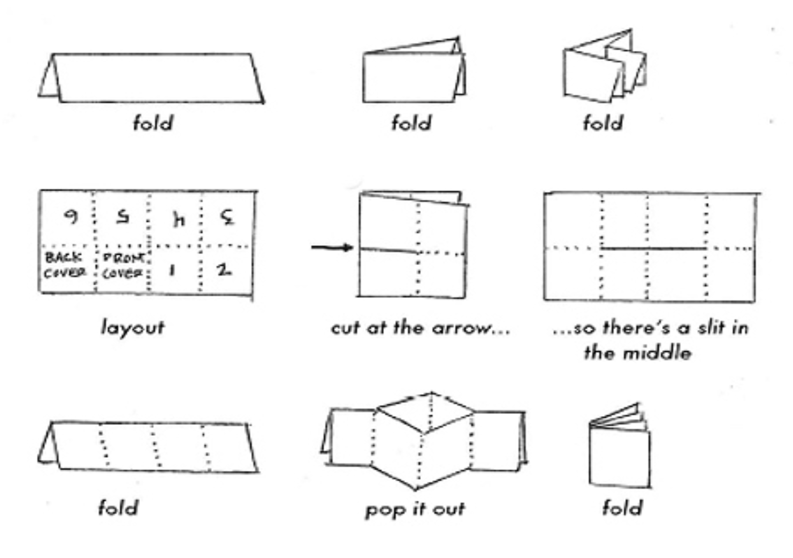

# queerzine
Some community zine making resources for the HSPH LGBTQIA+ Working Group.

**queerzine_template.pptx** is a Powerpoint file with guidelines for folding.
You can design in Powerpoint, print out your zine, and cut and fold. Please note
that most printers cannot print all the way to the edges of the sheet, so you will
want to allow for this in your design.

**queerzine_layout.pdf** shows where to cut and what order the pages will appear
(numbered) in the final layout.

You can also see some easy-to-follow directions for laying out, cutting, and folding 
your zine below:

